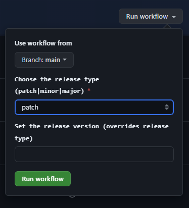

# Git Repository Commons

This repository contains scripts and config files that can be re-used and shared across other repositories of [link-intersystems](https://github.com/link-intersystems).
The scripts and config files can either be used by just copy and paste them or better to add them via `git subtree`.

> [!WARNING]  
> This repository was created to share common repository configuration and scripts within the
> [link-intersystems](https://github.com/link-intersystems) organization.
> 
> The configurations and scripts provided here might also work for you, since we usually keep them
> independent of organization specific stuff. But this might change in the future. 
> 
> So if you want to use them, use them with caution and only if you understand what these scripts do.
> 
> But you can also study this repository and build a similar one for your own organization.

## Apply default scripts and workflow configuration

In the root directory of the repository you wish to apply the scripts and workflows execute the following line:

```shell
curl -sSL https://raw.githubusercontent.com/link-intersystems/git-repo-commons/main/apply-project-facet.sh | bash -s -- gradle
```

This will download the [apply-project-facet.sh](apply-project-facet.sh) and immediately execute it. The option `gradle` tells the
init script to apply the configuration under the [gradle](gradle) directory of this repository.


## Gradle Project Commons

The gradle project commons are located under the [gradle](gradle) directory.

### Gradle Workflows

#### [gradle.yml](gradle/.github/workflows/gradle.yml)

This workflow just builds the project by invoking `./gradlew build`

#### [release.yml](gradle/.github/workflows/release.yml)

This workflow is a manually triggered workflow that takes inputs to execute a release.

It expects that your gradle project uses the `net.researchgate.release` plugin

```kotlin
plugins {
    id("net.researchgate.release") version "3.0.2"
}
```

Once installed in your repository you can trigger a release



It will then execute a `patch`, `minor` or `major` release on the current project.

You can also set a specific release version in the format `[0-9]+.[0-9]+.[0-9]+`. 
This setting will override the release type that you selected above.

The Gradle release plugin mentioned above will then update the versions, make commits and tag the
release version commit. After that it will push the changes and the commit tag.

In order to afterward trigger the publish workflow you need the release tag to be in the format `v[0-9]+.[0-9]+.[0-9]+`.

Therefore, you should configure the release plugin in that way:

```kotlin
release {
    tagTemplate = "v\${version}"
}
```

You should also configure the release plugin to not push to the remote by itself.
If it does, it uses the GITHUB_TOKEN and if the GITHUB_TOKEN pushes to the repository no
workflows will be triggered to prevent endless execution.

You can configure the release plugin in this way. This will allow you reenable the push by passing
`-PpushToRemote` to the Gradle build.

```kotlin
val pushToRemoteName = if(project.findProperty("pushToRemote") != null) "origin" else ""

release {
    git {
        pushToRemote = pushToRemoteName
    }
}
```
#### [publish.yml](gradle/.github/workflows/publish.yml)

The publish workflow uses the `io.github.gradle-nexus.publish-plugin` to publish the build artifacts to the maven central repository.

It is triggered by tags that follow the pattern `v[0-9]+.[0-9]+.[0-9]+`. The ones as created by the release workflow described above.


```kotlin
plugins {
    id("io.github.gradle-nexus.publish-plugin")
}
```

